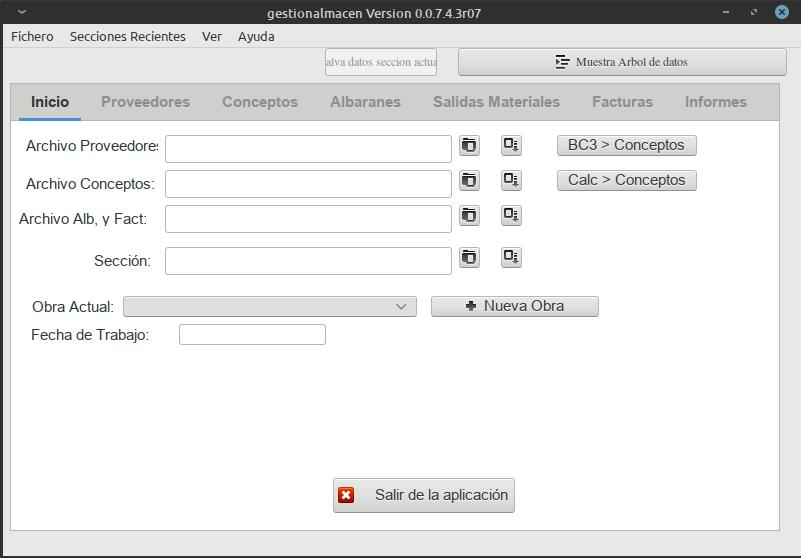
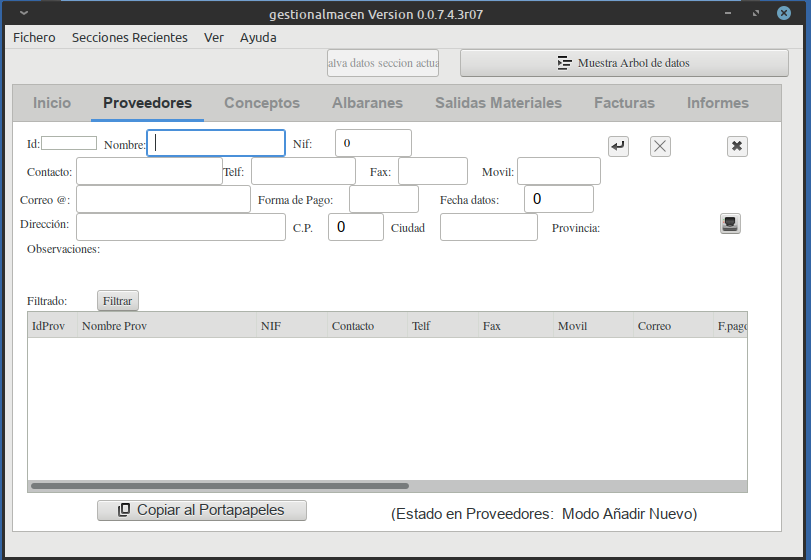
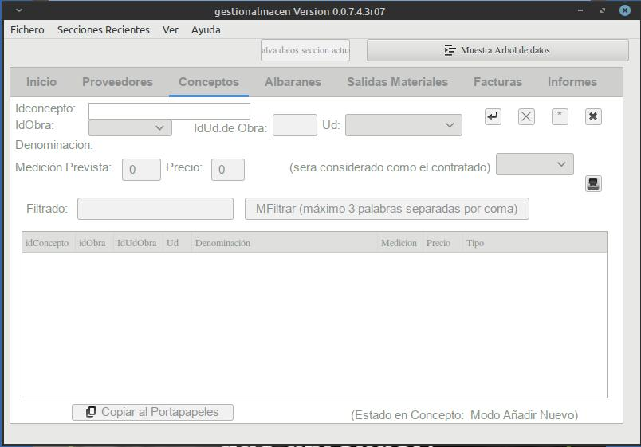
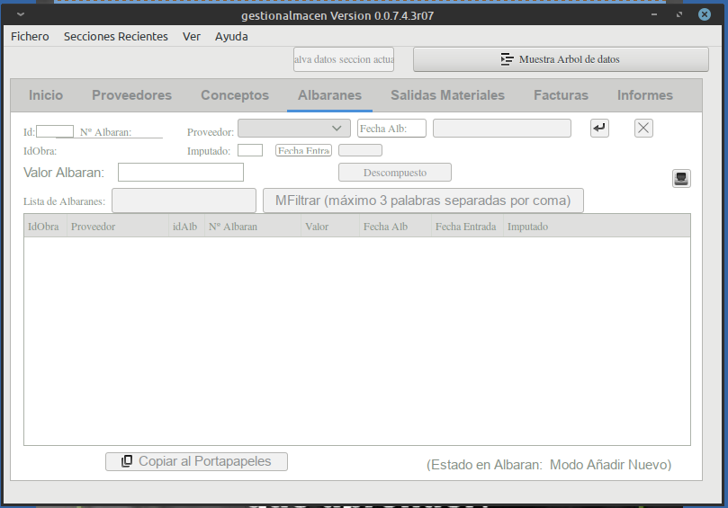
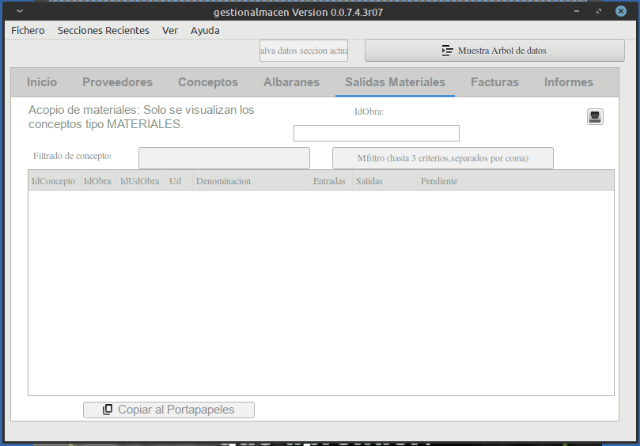
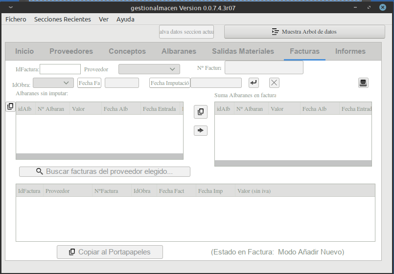
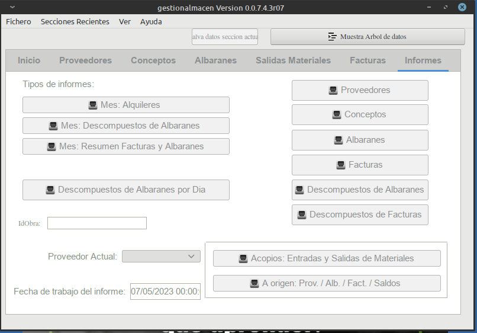

# Gestion Almacén de Obras

Las primeras versiones se realizaron para Gambas2, actualmente se esta actualizando a Gambs3.

Autor:
Julio Sánchez berro

Capturas del programa en Gambas3:

**Pestaña: Inicio**

**Pestaña: Proveedores**

**Pestaña: Conceptos**

**Pestaña: Albaranes**

**Pestaña: Salidas Materiales**

**Pestaña: Facturas**

**Pestaña: Informes**

